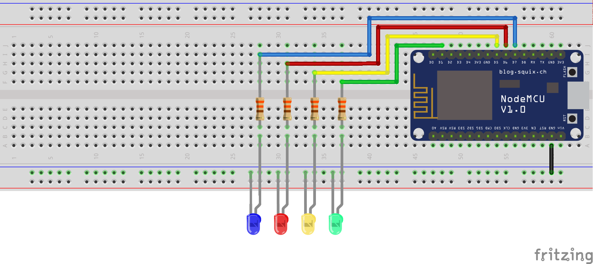

# **Home Automation System**

> #### A smart home automation system with device self-discovery

### Have you ever wondered how Alexa automatically discovers IoT devices in your local network?

> **The underlying protocol is called UPnP (Universal Plug-n-Play). It uses a protocol called SSDP(Simple Service Discovery Protocol) to discover devices in the local network and retreive their IP address and their services description.**

> **This project aims to demo that through a simple implementation of SSDP. The Node.js server uses SSDP to discover devices on the local network, and uses Socket.io to transmit to the client in real-time. Clients can not only connect and use devices, they can even associate with their account**

### Hardware List:

- NodeMCU ESP8266 (To emulate a smart LED Bulb)
- LEDs for switching one (prefferably coloured ones)
- 330 ohms resistor X 4
- Breadboard
- Jumper Wires

### Circuit Diagram



###### Made using [Fritzing](https://fritzing.org/)

### Instructions

- After setting up the circuit and flashing the code, boot up the NodeMCU.
- It starts in station mode, creating a WiFi hotspot with a name starting with `ESP`
- Connect to the hostpot, go to `192.168.4.1`.
- Add in your WiFi credentials, and then after the MCU reboots, you are ready to use it.

### Software Requirements

- Node.js 14.15.4 LTS
- Yarn 1.22.10

### Instructions

- To install dependencies:

```bash
yarn install
```

- Copy the `.env.sample` and rename it to `.env`.
- Edit the `.env` file to fill in your server details such as port number, JWT secret and MongoDB URI. To access the frontend, set `NODE_ENV` to `"production"`.
- To start the server:

```bash
yarn start
```

- Navigate to `http://localhost:<PORT>` to access your dashboard.
